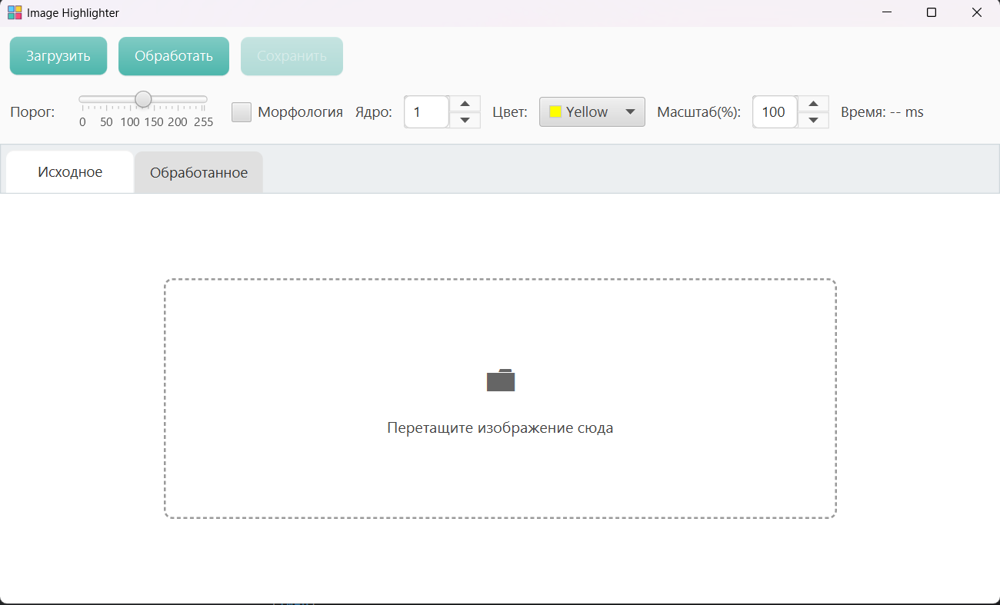
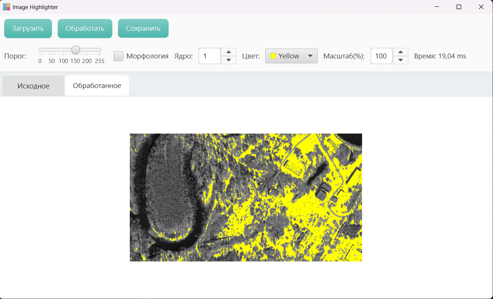

# ImageHighlighterGame

Простое JavaFX-приложение для **обработки монохромных изображений рельефа** с подсветкой высоких или рукотворных объектов.

## Основные возможности
- **Загрузка изображений**
- **Настройка порога**
- **Морфология**
- **Выбор цвета**
- **Сохранение результата в PNG/JPEG**

Ниже примеры интерфейса приложения:

1. **Главное окно** (перед загрузкой изображения):  
   

2. **Обработанное изображение** (подсветка жёлтым цветом):  
   

## Сборка и запуск

1. **Через Maven**:
   ```bash
   mvn clean javafx:run
   mvn javafx:run
